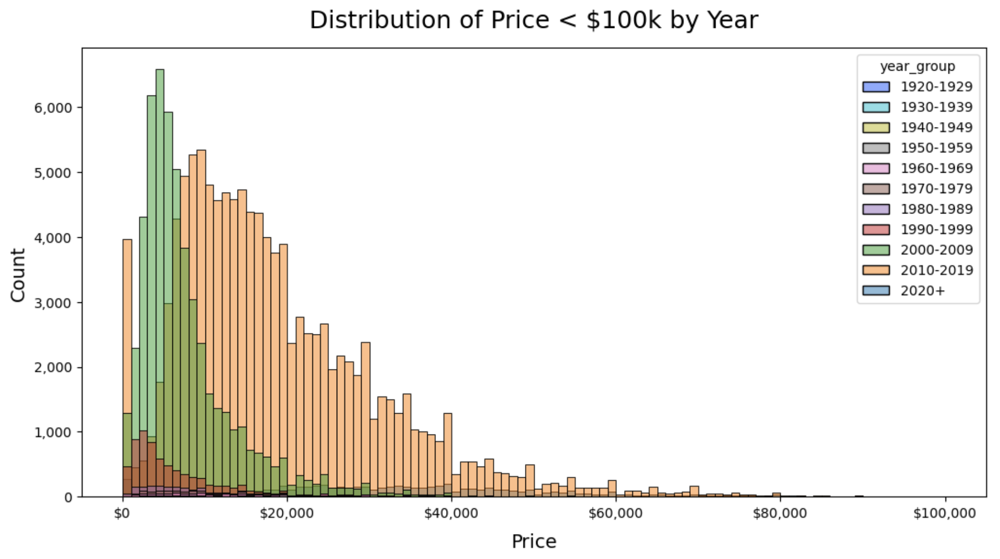

# Used Car Price Analysis
This is an analysis of used car listings on Craigslist done as a project for the U.C. Berkeley Certificate in Machine Learning & Artificial Intelligence. The entire process follows the CRISP-DM framework and is documented in this Jupyter notebook file:

* [usedcar.ipynb](usedcar.ipynb) (Too big to preview on Github)
* [Preview on nbviewer](https://nbviewer.org/urls/www.dropbox.com/scl/fi/z41l71lgnqs8yl8x0if4u/usedcar.ipynb/%3Frlkey%3Dzjl2y6u46vj6av6sde1iw0n61%26dl%3D1)

## Background

A group of used car dealerships would like to know what factors make a car more or less expensive. They are looking for clear recommendations on what consumers value in a used car so they can fine-tune their inventory. A [dataset](data/vehicles.csv) of 426K used car sales has been provided as the source for these insights. We will follow the **CRISP-DM** framework as a guide for our data analysis process, and strive to meet the following objectives.

## Business Objectives

* **Identify key drivers for used car prices** – The features in the provided dataset that have the highest correlation with price (positive and negative), and exhibit clear linear trends or separation of means, will be identified and shared with the client
* **Provide recommendations on what consumers value** – After analyzing and sythesizing the data, recommendations will be provided on how to adjust their inventory to align with consumer wants or needs.
* **Create price prediction model** – A machine learning model will be created that will attempt to predict the price of a car based on the relationships between features in our dataset. This will help the client accurately price the cars they have in inventory, and get the maximum value out of their assets.

## Data

The [data](data/vehicles.csv) for this project is a subset of a dataset created by Austin Reese by scraping used car entries on Craigslist, a large classified advertisement website. Here is the latest dataset on [Kaggle](https://www.kaggle.com/datasets/austinreese/craigslist-carstrucks-data), and here is the [script](https://github.com/AustinReese/UsedVehicleSearch) that was used to scrape the data from Craigslist.

# Summary of Findings

## Descriptive Statistics

Here's what we learned about the listings in this dataset. Keep in mind these are self-reported by the sellers that are creating these listings, so the data is likely biased and not entirely accurate:

### Numerical

After the data was cleaned to remove outliers and junk data, we can say the following about Price, Odometer, and Year:

- **Price:** The average price was **\$16,520**. The majority of the listings were between \$6,750 and \$22,380. Some were listed close to zero, and a number of them went much higher (\$349,999 for example).
- **Odometer:** The average odometer reading was **103,346**. The majority of the listings were between 51,806 and 142,929. Some were listed close to zero, and a number of them went much higher (900,000 for example).
- **Year:** The average year of the vehicle was **2010**. The majority of the listings were between 2007 and 2016. Some went as far back as 1923, with the most recent being 2022.

### Categorical

- Of the 42 Manufacturers, **Ford** (16.63%) was the most popular, followed by **Chevrolet** (12.9%) and **Toyota** (8.01%)
- Surprisingly, **Ferraris** do get sold on Craigslist – 95 times in this dataset!
- The majority of the vehicles were in **Good** (28.45%) or **Excellent** (23.77%) condition. However, many people did not specify a condition (40.79%). Perhaps they did not want to advertise anything negative.
- The most popular engine configuration was **6 Cylinders** (22.06%), followed by **4 Cylinders** (18.19%) and **8 Cylinders**     (16.88%). However, most people did not specify the cylinders (41.62%). Perhaps they did not know.
- For the drive train, **4-Wheel Drive (4WD)** (30.9%) was the most popular, followed by **Front-Wheel Drive (FWD)** (24.72%), and then **Rear-Wheel Drive (RWD)** (13.8%). A large number did not specify the drive train (30.59%). Perhaps they did not know.
- Most people did not specify the size of the vehicle (71.77%), which is surprising. Perhaps they did not know how to properly classify it. After that, the order was: **Full-Size** (14.87%), **Mid-Size** (8.08%), **Compact** (4.54%), and **Sub-Compact** (0.75%).
- **Sedan** (20.39%) was the most popular type, followed by **Sport-Utility Vehicle (SUV)** (18.1%) and **Pickup** (10.19%). However, 21.75% did not specify a type.
- **Gas** was the dominant fuel type at 83.44%
- Almost all the titles were **Clean** (94.9%). There are some interesting title status values: Rebuilt, Lien, Salvage, Parts Only.
- **Automatic** was the dominant transmission (78.83%)
- **White** was the most popular color, after the 30.5% that did not specify a color. **Purple** was the least popular color (0.16%)
- Most of the listings were in **CA** (11.86%) > **FL** (6.68%) > **TX** (5.38%) > **NY** (4.54%), in that order. **Columbus, OH** and **Jacksonville, FL** were the most popular listing regions.

## Business Objectives

### 1. Identify key drivers for used car prices

Here are the main drivers of used car prices.

#### Characteristics that Increase Price

- **Year** is slightly correlated with Price (0.28), which makes sense. Newer cars tend to cost more than older cars, but we saw from our plots that there may be a class of older cars that cost more, which may be holding this correlation down.
- **Cylinders** is slightly correlated with Price (0.25), suggesting the more cylinders, the more expensive the vehicle. 
- **Diesel** (0.24) and **4WD** (0.22) are slightly correlated with Price, suggesting those type of work or offroad vehicles command a premium.
- **Condition** (0.18) is slightly correlated with Price, suggesting cars that are in better condition will sell for more. But it's not the main driver of price (in this dataset, at least)
- **Pickup** (0.18), **Truck** (0.16), and **Ram** (0.14) are slightly correlated with Price, suggesting these types of vehicles are slightly more expensive.
- **Size** is slightly correlated with Price (0.13), suggesting larger vehicles cost a little more.
- In addition to Ram, a few manufacturers also seem to have a slight correlation with Price: **Ferrari** (0.12), **Porsche** (0.08), **GMC** (0.08), **Tesla** (0.07), and **Ford** (0.07).

#### Characteristics that Decrease Price

- **Odometer** is moderately negatively correlated with Price (-0.42), which makes sense. Vehicles with more mileage are going to sell for less. This is the **strongest relationship** in our data set, and may be the main independent variable.
- **Gas** (-0.23) and **FWD** (-0.23) are slighlty negatively correlated with Price, suggesting those less complicated fuel and drive trains are cheaper.
- Conversely, **Sedan** (-0.16) and **Honda** (-0.1) are slightly negatively correlated with Price, suggesting they are slightly cheaper options.
- In addition to Honda, a few manufacturers seem to have a weak negative correlation with Price: **Nissan** (-0.07), **Chrysler** (-0.06), and **Hyundai** (-0.06).
- And lastly, vehicles with **Automatic** transmission (-0.08), or that are **Hatchbacks** (-0.06) or **Minivans** (-0.06), tend to be slightly cheaper.

  

    
  

  

    
  

  

    
  

### 2. Provide recommendations on what consumers value

Here is how used car dealears can adjust their inventory to align with consumer wants and needs. This assumes higher prices represent consumer demand, and lower prices represent a lack of demand:

#### Increase Supply of the Following

* Modern cars in recent years, with low odometer readings, in good condition
* Cars with more cylinders (8-cylinder, 6-cylinder or more) and larger size (Full-size, Mid-size)
* Diesel and 4WD vehicles classified as Pickup or Truck
* Stock more of these manufacturers: Ram, Ferrari, Porsche, GMC, Tesla, Ford

#### Decrease Supply of the Following

* Older cars, with high odometer readings, in poor condition (or with unknown condition)
* Cars with less cylinders (4-cylinder or lower) and smaller size
* Gas and FWD vehicles with Automatic transmission
* Vehicle of type Sedan, Hatchback or Minivan
* Stock less of these manufacturers: Honda, Nissan, Chrysler, Hyundai

It's important to note that all of these car types exhist for a reason: There are people that really want an automatic, gas-powered sedan; or that need a hatchback or minivan; or love Hondas, or older cars. There is likely some demand for these, they just don't seem to command a premium.

### 3. Create price prediction model

After several iterations, we were able to deliver a model that can predict price with roughly a 70% "accuracy." Here are some things to note about this model:

* The model accounts for about **70% of the variance** in used car prices (R^2 0.70)
* The model has an average error of about **$4,852 (MAE)**
* The model is based on a **filtered dataset** of used car listings with prices between \$1,000 and \$80,000, odometers between 1,000 and 400,000, and older than 1980.
* We believe this is representative of the typical range of **most used cars sold at dealers**
* Given this range, it excludes certain classic cars or antiques that are likely priced on a different model
* **All duplicates and junk data were stripped** from the dataset, so it should generalize well to unseen data
* The model is a Linear Regression model based on the **top 40 correlated features** from our analysis
* The main drivers of the model (its top coefficients) are: **Odometer, Year, Ferraris, Teslas, Porsches, and Diesel fuel.**
* Some technical details (feel free to ignore): Pipeline was: Ordinal encoding, One-Hot Encoding, Log transformation, Polynomial degree 2 transformation, Ridge, GridSearchCV of alpha 0.001 - 100,000. Best alpha was 0.001.

A detailed log of the model iterations can be found here: [results_df_20230829_024020.csv](results_df_20230829_024020.csv)

  

    
  

  

    
  

## Limitations

There are a few limitations in the data:

* **Junk Data:** This dataset was filled with a lot of junk data, duplicate listings, missing values, and required a significant amount of cleaning to remove duplicates or impossible values. Some of it is clearly not accurate.
* **Cleaning Impact:** As part of our data cleaning, a number of records were removed. Only 44.76% of the original dataset was retained. We may have unintentionally removed data that was legitimate, which could impact our conclusions.
* **Biased Listings:** The basis of this dataset are postings on Craigslist by sellers, so there is clearly a bias in them – they want to sell their vehicle.
* **Advertisements Only:** The numbers in this dataset are only the listing price, we do not know (a) if this transaction ever closed, nor (b) what the final sales price was.
* **Dataset Questions:** Some of the listings could also be from people that are looking to buy ("Wanted" or "Looking for" ads), it's not clear if they are included in this dataset. But that could explain the large amount of missing values.

## Next Steps and Recommendations

To better understand the drivers of supply and demand in used car prices, this project could be followed up in the following ways:

* **New Dataset:** Obtain a dataset of actual verified sales transactions – not just the advertised listings. This will increase our confidence and accuracy of any findings significantly.
* **Survey Consumers:** Conduct a survey of consumers to find out what they value or care about when looking for a used car. The dataset we have is possibly one-sided, representing only the supply of sellers. But there could be a mismatch in supply and demand. 
* **Different Models:** In this project, we only used linear regression models, but we could also explore alternative models that may be able to better utilize the existing dataset.
